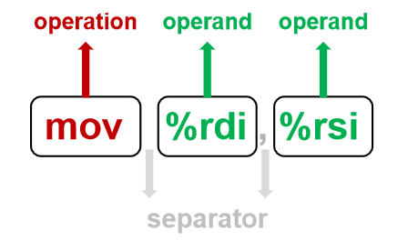

# 指令集解析
本篇文章阐述了 Assembler 如何对汇编指令集做解析。

## 0. 解析汇编指令集的意义
Assembler 本质是一个汇编模拟器，因此它的内部定义了一个结构体 `inst_t` 用于保存用于模拟的指令集：
```c
typedef enum OperandType { NUL, IMM, REG, MEM } OperandType;

// define operand.
typedef struct operand_t {
  OperandType type;
  int64_t imm;
  int64_t scal;
  uint64_t *reg_b;  // base register
  uint64_t *reg_i;  // index register
} operand_t;

// define opeartion. e.g. MOV, CALL...
typedef enum Operation {
  MOV_IMM_REG,
  MOV_MEM_REG,
  MOV_REG_REG,
  MOV_IMM_MEM,
  MOV_REG_MEM,
  ADD_REG_REG,
  CALL,
  RET,
  PUSH,
  POP
} Operation;

// define instruction. e.g. mov %rdx, %rdi
typedef struct inst_t {
  operand_t src;
  operand_t dst;
  Operation op;
  const char *code;
} inst_t;
```
例如对于 `push %rbp` 的模拟，可定义如下：
```c
{
  { REG, 0, 0, &reg.rbp, NULL },  // src  
  { NUL, 0, 0, NULL, NULL },      // dst
  PUSH,                           // op
  "push   %rbp"                  // code          
}
```
可是当指令规模达到数十条甚至上百条时，手动地翻译指令并将其填充到代码区中将变得非常地繁琐且易于出错，因此将解析的流程交给代码来做就显现的非常有必要，这也是为什么 Assembler 需要做指令集解析。

## 1. 方案描述
因此，根据第 0 章的分析，我们期望的形式如下：
```c
char *code [18][64] = {
  "push   %rbp",
  "mov    %rsp,%rbp",
  "mov    %rdi,-0x18(%rbp)",
  "mov    %rsi,-0x20(%rbp)",
  "mov    -0x18(%rbp),%rdx",
  "mov    -0x20(%rbp),%rax",
  "add    %rdx,%rax",
  "mov    %rax,-0x8(%rbp)",
  "mov    -0x8(%rbp),%rax",
  "movq   $0x12340000,-0x18(%rbp)",
  "movq   $0xabcd,-0x10(%rbp)",
  "mov    -0x10(%rbp),%rdx",
  "mov    -0x18(%rbp),%rax",
  "mov    %rdx,%rsi",
  "mov    %rax,%rdi",
  "callq  0x8001129 <add>",
  "mov    %rax,-0x8(%rbp)",
  "mov    $0x0,%eax"
};
```
在写代码的时候，只需将指令集用字符串数组存储下来，Assembler 可以自动解析字符出数组中的每一条字符串，存储到 `.text` 段中。同时我们规定每个指令最大长度为64。

根据 X86 的汇编指令字符出的格式，我们可以将汇编指令集拆解成三个部分：指令、源操作数以及目标操作数，其中指令与源操作数依靠空格分隔，而源操作数与目的操作数则是依靠逗号分隔，如下图所示：



因此，对于解析指令这项大的任务来说，我们可以将其拆解为3个小项：
- 解析指令：目前我们需要解析的指令有 mov、add、sub、leaveq、call、ret、push、pop 等
- 解析操作数：立即数、寄存器以及内存地址
- 指令和操作数拆解

## 2. 方案设计
本章主要针对第一章所描述的3个小项做方案设计。

### 2.1 指令解析


