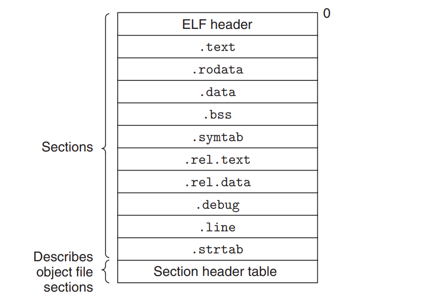

# 链接（Linking）

## 0. 前置知识
要能准确地理解链接诞生的意义，需要先从源文件到二进制文件的产生过程说起。当编译一个简单的程序时：
```c
// array.c
#include "array.h"

array[index] = 10086;

int main(void) {
    return 0;
}
```
只需要通过一条简单的 GCC 命令即可搞定：
```bash
gcc -o array array.c
```
而这条命令的背后实际隐藏了编译的 4 个过程：**预处理（Prepressing）**、**编译（Compilation）**、**汇编（Assembly）**以及**链接（Linking）**，它们的作用如下表和图所示：
|过程|作用|
|--|--|
|预处理|处理源文件中以"#"开始的预编译指令。展开所有的"#define"宏、包含的头文件（递归展开），删除注释等。预编译后的文件将不包含任何宏定义，因为它们都已经被展开了|
|编译|编译会将预编译后的代码转换为对应的汇编代码。主要过程包括词法分析、语法分析、语义分析以及优化等|
|汇编|汇编通过汇编器将生成的汇编代码转化为机器可以执行的指令，输出目标文件（Object file）|
|链接|链接过程最终将生成的多个目标文件以及一些外部文件（动态库、静态库）链接在一起生成一个可执行文件|

array.c 文件产生的汇编代码大致如下：
```asm
movl index, %ecx
addl $4,  %ecx
mull $8,  %ecx
movl %ecx, array(,eax,4)
```

从产生的汇编文件中可以看出，在经过编译之后将源代码编译成了汇编代码，但是我们如何确定全局变量 `array` 以及 `index` 的地址？如果 `array` 和 `index` 直接在同一个编译单元中定义的话，那么在编译的时候我们就可以直接知道它的地址并为其分配空间，但如果这两个变量是定义在其他模块中的话，那么这一部分的信息将是缺失的，编译器也就无法确定它们最终的地址了。

因此现在的编译器可以将源代码文件编译为一个未链接的目标文件，然后由链接器最终将这些目标文件链接起来形成可执行文件。链接的过程中，链接器会对目标文件中未确定地址的目标修改成正确的地址，这个过程叫做**重定位**。

## 1. 链接的意义
构造大型程序需要用到链接技术。在中大型的项目中，基本不可能直接将所有文件通过一条 `gcc` 命令直接生成二进制文件，会有如下缺陷：
- 全量编译：每修改一次文件都需要进行全量编译
- 编译缓慢：无法进行并行编程，编译速度非常缓慢
- 非模块化：模块与模块之间可以做到清晰的边界

因此在现在大中型项目中，经常会以模块的视角对项目进行拆分构建出目标二进制文件。而以模块的视角进行编译的过程中，就会产生**可重定位目标文件**，**静态链接库**以及**动态链接库**，而这些文件如何组合成最终的二进制文件，就需要用到链接技术。而具体的链接器又可分为静态链接器以及动态链接器。

### 1.1 静态链接
静态链接器以一组可可重定位目标文件和命令行参数作为输入，生成一个完全链接的、可以加载和运行的可执行目标文件作为输出。

静态链接器主要完成了以下两大功能：
- **符号解析（symbol resolution）**：目标文件会定义与引用符号，符号的类型有诸如函数、一个全局变量或一个静态变量（static 修饰的变量）。符号解析的作用是将每个符号引用和一个符号定义关联起来。
- **重定位（relocation）**：编译器和汇编器生产从地址0开始的代码和数据节（section）。链接器通过把每个符号定义与一个内存位置关联起来，从而重定位这些节，然后修改所有对这些符号的引用，使它们指向这个内存区域。链接器使用汇编器产生的重定位条目（relocation entry）的详细指令，不加甄别地执行这样的重定位

### 1.2 动态链接
动态链接指的是动态链接库运行或加载到任意的内存地址，并和一个在内存中的程序链接起来的过程。动态链接特点如下：
- 动态链接可发生在编译时或运行时
- 动态链接库具有位置无关的特点

## 2. 可重定位目标文件
可重定位目标文件（object file）由编译器和汇编器生成，在 Linux 和 Unix 系统中以 ELF 格式进行存储。ELF 全称为 Executable and Linkable Format，即*可执行可链接格式*。

### 2.1 ELF 格式存储的可重定位目标文件
典型的 ELF 可重定位目标文件如下图所示：


|类型|描述|
|--|--|
|ELF header|前16个字节序列描述了生成该文件的系统的字的大小和字节顺序。剩余部分则包含了帮助链接器语法分析和解释目标文件的信息，包括 ELF header 的大小、目标文件类型（可重定位的、可执行的、共享的）、机器类型、section header table 的文件偏移以及 section header table 中 entry 的数量和大小等|
|Section header table|不同 section 的位置和大小是由 section header table 进行描述的，其中目标文件中每个节都有一个固定大小的 entry|
|.text|已编译程序的机器代码|
|.rodata|read only data，例如 printf 语句中的格式字符串和 switch 语句的跳转表|
|.data|已初始化的全局和静态 C 变量|
|.bss|未初始化的全局和静态 C 变量，以及所有被初始化为 0 的全局或静态变量。在目标文件中这个 section 仅作为占位符存在而不占据实际空间用以优化空间效率|
|.symtab|符号表，用于存放程序中定义和引用的函数和全局变量的信息|
|.rel.text|.text 中位置的列表，当链接器把这个目标文件和其他文件组合时，需要修改这些位置|
|.rel.data|被模块引用或定义的所有全局变量的重定位信息。一般而言，任何已初始化的全局变量，如果它的初始值是一个全局变量地址或者外部定义函数地址，都需要被修改|
|.debug|调试符号表，以 -g 编译程序的时候才会得到这张表|
|.line|原始 C 源程序中的行号与 .text 段机器码的映射，以 -g 编译程序的时候才会得到这张表|
|.strtab|字符串表，内容包括 .symtab 和 .debug 中的符号表，以及 section header table 中的 section 名字。它是以 null 结尾的字符串序列|

### 2.2 可重定位目标文件的符号和符号表
每一个可重定位目标模块 m 都有一个符号表，它包含模块本身定义和引用的符号的信息，这些符号可分为以下三类：
|类别|描述|
|--|--|
|m 定义的全局符号|这些符号由 m 定义并被其他模块引用，对应非静态的 C 函数和全局变量|
|m 引用的全局符号|这些符号定义在其他模块中但被 m 引用，又称为外部符号。对应在其他模块中定义的非静态的 C 函数和全局变量|
|m 定义和引用的局部符号|对应带 static 属性的 C 函数和全局变量。这些符号在 m 中任何位置均可见，但是不能被其他模块引用|

符号表由汇编器构造。.symtab 节中包含 ELF 符号表，这张符号表包含了一个 entry 数组，entry 的结构如下：
```c
typedef struct {
    int   name;      /* String table offset */
    char  type:4,    /* Function or data (4 bits) */
          binding:4; /* Local or global (4 bits) */
    char  reserved;  /* Unused */
    short section;   /* Section header index */
    long  value;     /* Section offset or absolute address */
    long  size;      /* Object size in bytes */
} Elf64_Symbol;
```
字段的具体描述如下表：
|字段|描述|
|--|--|
|name|字符串表 .strtab 中的字节偏移，指向符号的以 null 结尾的字符出的名字|
|value|指向符号表的地址。对于可重定位目标模块来说，value 是一个相对定义目标的 section 的起始位置的偏移；对于可执行目标文件来说，改值是一个运行时的绝对地址|
|size|目标的大小|
|type|表示数据或函数|
|binding|表示符号是本地的还是全局的|
|section|表示符号属于哪个 section 索引|

对于这些记录在 .symtab 的符号来说，它们都被分配在目标文件的某个 section 当中，由 srction 字段表示，该字段是一个到 section header table 的索引。

而有一部分 entry 它们的 section 字段比较特殊，为 ABS/UNDEF/COMMON，这些被称为伪节（preudosection），因为它们在 section header table 中不存在 entry。

|定义|描述|
|--|--|
|ABS|表示不该被重定位的符号|
|UNDEF|表示未定义的符号，即在本模块中引用却定义在其他模块|
|COMMON|表示还未被分配位置的未初始化的数据目标|

需要注意的是伪节只在可重定位目标文件中存在，而可执行目标文件不存在伪节。

### 2.3 可重定位目标文件的符号解析

- object file的内容简介
- 符号、符号表的定义、符号解析
- linker解析多重定义符号的规则
## 3. 静态库
- 静态库存在的意义（和object file做比较）
- linker如何解析静态库符号（和object file做比较）
## 4. 重定位
- 重定位Entry的作用（.rel.text .rel.data）
- 重定位的符号引用（重定位PC相对引用和重定位绝对应用），什么时候相对什么时候绝对，举例子
## 5. 可执行文件
- 可执行文件的ELF结构（和object file比较）
- 可行性文件如何加载进内存，在内存中的分布
## 6. 动态链接库
- 动态链接库相比静态链接库的优势
- 编译期与运行期加载动态链接库
- 动态链接库与位置无关的必要性（GOT、PLT），程序如何加载动态链接库